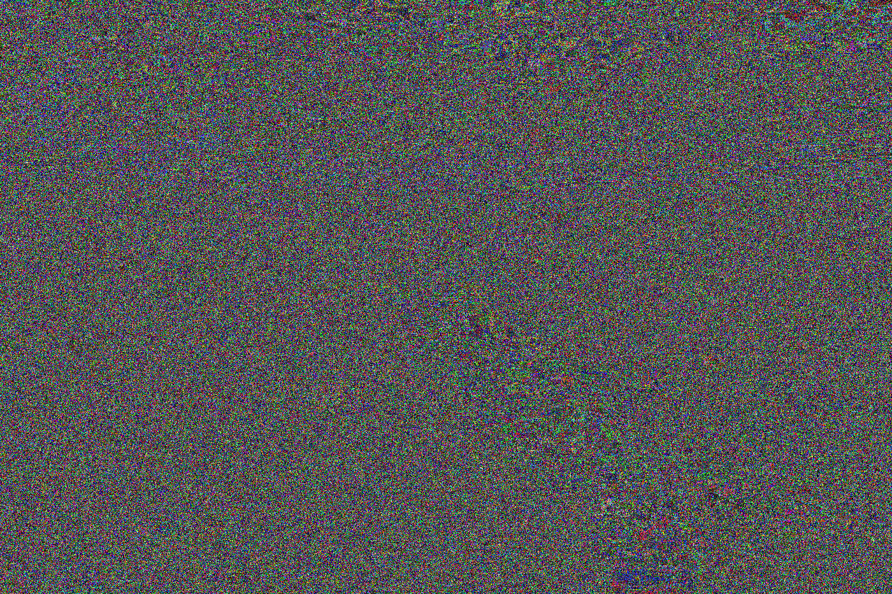

<div align="center">

# Steganographer

**Hide files inside images. Encrypted, signed, deniable, and invisible to the eye.**

[](https://github.com/priyansh-anand/steganographer/actions/workflows/ci.yml)
[](https://www.python.org/downloads/)
[](LICENSE)
[](https://priyansh-anand.github.io/steganographer/)

[Live demo](https://priyansh-anand.github.io/steganographer/) ·
[Documentation](#documentation) ·
[Install](#installation) ·
[Quick start](#quick-start)

</div>

---

| Original photo | With an entire book hidden inside | Difference × 85 |
| :---: | :---: | :---: |
|  |  |  |

The middle image holds the full text of *The Adventures of Sherlock Holmes*: 107,558 words, encrypted and
spread across 1.3 million pixels. No colour value moved by more than 3 out of 255. The right panel is the
difference between the two, multiplied by 85 so you can see it at all.

Download [`fjord-hidden.png`](docs/images/fjord-hidden.png) and try it yourself:

```sh
steganographer -e -i fjord-hidden.png -p readme-demo
```

## Features

| | |
| --- | --- |
| 🖼️ **Invisible embedding** | Writes into the two lowest bits of each colour channel, a change the eye can't see. |
| 🔐 **Authenticated encryption** | Fernet (AES-128 + HMAC-SHA256) with scrypt key derivation. The password also scatters the data, so without it the image shows no sign of carrying anything. |
| ✍️ **Signatures** | Sign with your existing Ed25519 SSH key. Recipients verify against your GitHub public keys. |
| 🎭 **Plausible deniability** | Two files, two passwords, one image. Hand over the decoy, keep the real one hidden. |
| 📷 **Survives JPEG** | `robust` mode outlasts the recompression chat apps and social networks apply. |
| 🌿 **Adaptive placement** | Puts data in textured regions first, where it's hardest to detect. |
| 🔎 **Built-in steganalysis** | Runs chi-square and RS analysis on your output, so you can see how detectable it is. |
| 🌐 **Runs in the browser** | The [live demo](https://priyansh-anand.github.io/steganographer/) runs the real package via Pyodide. Your files never leave the tab. |

## Installation

Requires Python 3.12 or newer.

```sh
uv tool install git+https://github.com/priyansh-anand/steganographer
```

<details>
<summary>Other ways to install</summary>

```sh
# pip
pip install git+https://github.com/priyansh-anand/steganographer

# run once without installing
uvx --from git+https://github.com/priyansh-anand/steganographer steganographer --help

# from a clone
pip install -r requirements.txt && python3 steganographer.py --help
```

</details>

## Quick start

```sh
# hide notes.txt inside photo.jpg, prompting for a password
steganographer -i photo.jpg -h notes.txt -m lsb -P
# -> photo_steg0.png

# get it back (saved as notes.txt; the mode is detected automatically)
steganographer -e -i photo_steg0.png -P

# how much fits, and is anything already hidden?
steganographer --info -i photo.jpg
```

From Python:

```python
import steganographer

steganographer.hide("photo.jpg", b"meet at noon", "photo_steg0.png", mode="lsb", password="hunter2")
steganographer.reveal("photo_steg0.png", password="hunter2")  # b'meet at noon'
```

## Choosing a mode

| | `lsb` | `endian` | `robust` |
| --- | --- | --- | --- |
| **How** | Low bits of every pixel | Appended after the image data | Nudges DCT coefficients |
| **Invisible** | Yes | To viewers, not to a hex editor | Yes |
| **Capacity** | ~0.75 bytes per pixel (1.5 MB in a 1080p image) | Unlimited | ~1 bit per 8×8 block (3.5 KB in a 1080p image) |
| **Survives JPEG recompression** | No | No | **Yes** |
| **Best for** | Files of any kind | Large files, any format | Short messages you'll share on social media |

`endian` is the default. For anything sensitive, use `lsb` with a password.

### JPEG and other formats

Every mode accepts **any input Pillow can open**, including JPEG, PNG, WebP, BMP, TIFF and GIF. What changes
is the output:

| Mode | Output formats | Default output | After re-saving as JPEG |
| --- | --- | --- | --- |
| `lsb` | PNG, BMP, TIFF (JPEG is refused) | `<name>_steg0.png` | Data lost |
| `endian` | Same format as the input, including JPEG | `<name>_steg0.<input ext>` | Data lost |
| `robust` | PNG or JPEG | `<name>_steg0.png` | **Data survives** |

`lsb` refuses JPEG output because a single JPEG save, even at quality 95, erases the bits it writes. If the image
will go through a messaging app or a social network, use `robust` or send the image as a file attachment.

## Feature tour

**Encrypt.** `-P` prompts for a password, so it stays out of your shell history. In `lsb` mode the password also
decides which pixels carry the data.

```sh
steganographer -i photo.png -h secret.pdf -m lsb -P
```

**Sign and verify.** Prove who hid a file, and that nobody changed it.

```sh
steganographer -i photo.png -h plan.txt -m lsb -P --sign ~/.ssh/id_ed25519
curl -s https://github.com/<username>.keys > sender.pub
steganographer -e -i photo_steg0.png -P --verify sender.pub
```

**Hide a decoy.** Each password reveals a different file. Nothing in the image shows there are two.

```sh
steganographer -i photo.png -h real.txt -p real-pass --decoy decoy.txt --decoy-password decoy-pass
steganographer -e -i photo_steg0.png -p decoy-pass    # -> decoy.txt
steganographer -e -i photo_steg0.png -p real-pass     # -> real.txt
```

**Survive recompression.** Tested against repeated JPEG saves down to quality 40.

```sh
steganographer -i photo.jpg -h note.txt -m robust -P -o shareable.jpg
```

**Place data where it's hardest to find**, then check how exposed the result is:

```sh
steganographer -i photo.png -h notes.txt -m lsb -P --adaptive
steganographer --analyze -i photo_steg0.png
```

The [CLI reference](docs/cli.md) covers every option.

## Documentation

| Guide | What's in it |
| --- | --- |
| [CLI reference](docs/cli.md) | Every command and option, defaults, exit codes, and recipes |
| [Python API](docs/python-api.md) | Functions, types and exceptions, with examples |
| [How it works](docs/how-it-works.md) | Embedding, encryption, byte layouts, robust mode, deniability, and the steganalysis tests |
| [Security model](docs/security.md) | What Steganographer protects against, what it doesn't, and how to use it safely |
| [Browser demo](web/README.md) | How the Pyodide demo works and how to run it locally |
| [Changelog](CHANGELOG.md) | Release history |

## Development

```sh
git clone https://github.com/priyansh-anand/steganographer && cd steganographer
uv run pytest                 # tests
uv run ruff check .           # lint
uv run ruff format --check .  # formatting
```

CI runs the tests on Linux (Python 3.12–3.14), macOS and Windows. Contributions are welcome. Please read the
[Code of Conduct](CODE_OF_CONDUCT.md) first.

## Credits

- Demo photo: [fjord landscape](https://unsplash.com/photos/-oWyJoSqBRM) by Alexey Topolyanskiy on
  [Unsplash](https://unsplash.com), used under the [Unsplash License](https://unsplash.com/license).
- Hidden text: [*The Adventures of Sherlock Holmes*](https://www.gutenberg.org/ebooks/1661) by Arthur Conan
  Doyle, in the public domain, via [Project Gutenberg](https://www.gutenberg.org).

## License

[MIT](LICENSE) © Priyansh Anand
